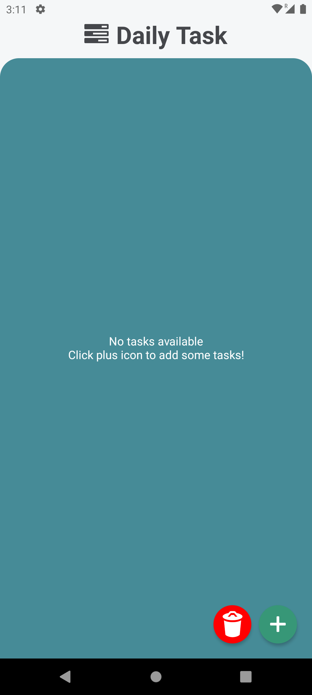
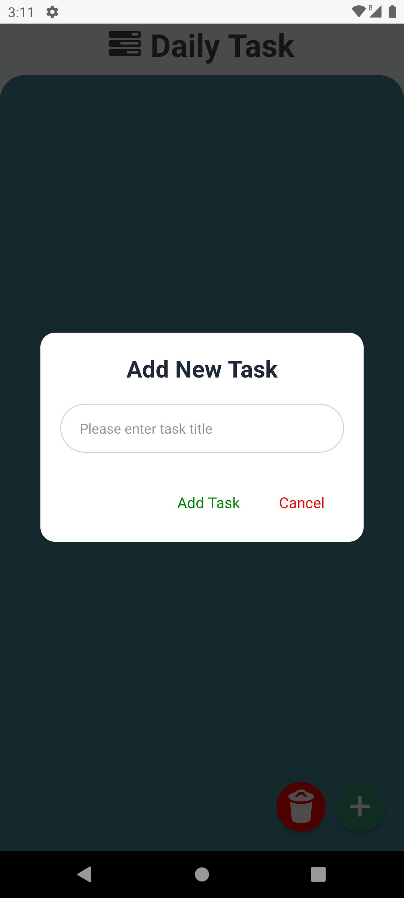
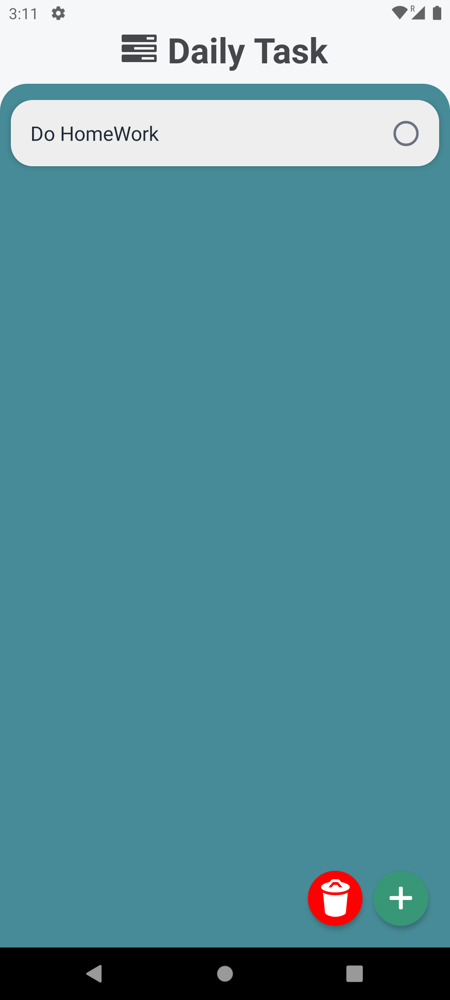
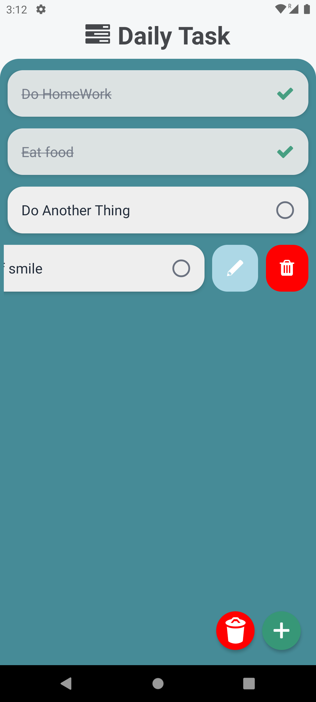

# Daily Tasks React Native App

 This is the app I first built with my React Native development, I have this code since many time in my computer, so i dumped it here. You can read it and get reference if you are begginer in [React Native](https://reactnative.dev/) Thanks!

---

## Table of Contents

- [Overview](#overview)
- [Features](#features)
- [Installation](#installation)
- [Screenshots](#screenshots)
---

## Overview

A easy and simple app for managing your daily tasks 

---

## Features

Here some simple features

- Add task
- Tick after completetion
- Swipable remove
- Swipable edit

---

## Installation

Here is the installatation steps to install the app and run 

### Prerequisites

- Node.js
- npm or yarn
- React Native development environment set up

### Clone the repository

```bash
git clone https://github.com/adistar-js/dailytask-mobile-app.git

cd dailytask-mobile-app
```
### Install dependencies

```bash
npm install
# or
yarn install
```

### Run the app

```bash
# Ensure your emulator or device is connected
npx react-native run-android
# or
npx react-native run-ios
```

## ScreenShots

<div style="display: flex; flex-direction: row; justify-content: center;">
    
    
</div>

<div style="display: flex; flex-direction: row; justify-content: center; margin-top: 20px;">
    
    
</div>
